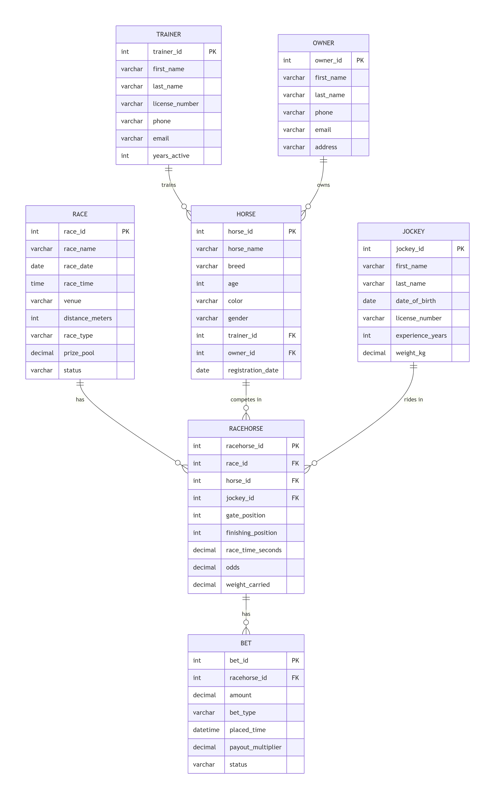

# RaceDay System - Complete Database Schema

[](https://classroom.github.com/a/mr-hqvA6)

---

## Overview

The **RaceDay System** is a comprehensive event management database designed for **running, walking, and cycling events** in South Africa. This database schema supports the complete management of events, including:

- User management with role-based access (Organisers and Participants)
- Event creation and management
- Participant enrolment in event categories
- Weather forecasting for race day
- Route and course management
- Race results and performance tracking
- Payment and enrolment status management
- Role-based access control

---

## Technology Stack

| Component | Technology |
|-----------|------------|
| Database | Microsoft SQL Server |
| Management Tool | SQL Server Management Studio (SSMS) |
| Language | T-SQL |

---

## Database Schema

### Core Entities (11 Tables)

| # | Entity | Description |
|---|--------|-------------|
| 1 | USER | System users (Organisers and Participants) |
| 2 | ROLE | User roles (Organiser, Participant) |
| 3 | USERROLE | Junction table for User-Role many-to-many |
| 4 | EVENT | Main running/walking/cycling events |
| 5 | CATEGORY | Event categories (age groups, gender, etc.) |
| 6 | ENROLMENT | Participant enrolments in event categories |
| 7 | PARTICIPANT_EVENT | Participant entries in events |
| 8 | WEATHER | Weather forecasts for events |
| 9 | ROUTE | Event routes and courses |
| 10 | ROUTE_WAYPOINT | GPS waypoints along the route |
| 11 | RESULT | Participant race results |

---

## Entity Relationship Diagram (ERD)




## Installation Guide

### IMPORTANT: Follow These Steps in Order

To avoid errors, **you must create the database first** and then **create tables one by one in the correct order**.

---

### Prerequisites

- SQL Server Management Studio (SSMS) - Download Here
- SQL Server 2019 or later - Download Here
- Appropriate database permissions (CREATE TABLE, INSERT, ALTER)

---

### Step 1: Create the Database

Open SSMS and run this command first:

```sql
-- Create the database
CREATE DATABASE RaceDayDB;
GO

-- Switch to the new database
USE RaceDayDB;
GO

-- Verify you're in the correct database
SELECT DB_NAME() AS CurrentDatabase;
GO
```

**Expected Output:** `RaceDayDB`

---

### Step 2: Create Tables in Correct Order

> **IMPORTANT:** Tables must be created in the correct order to avoid foreign key errors.

#### Recommended Table Creation Order:

1. **USER** (Parent table)
2. **ROLE** (Parent table)
3. **USERROLE** (References USER and ROLE)
4. **EVENT** (Parent table)
5. **CATEGORY** (References EVENT)
6. **ENROLMENT** (References USER, EVENT, CATEGORY)
7. **PARTICIPANT_EVENT** (References EVENT, USER, CATEGORY)
8. **WEATHER** (References EVENT)
9. **ROUTE** (References EVENT)
10. **ROUTE_WAYPOINT** (References ROUTE)
11. **RESULT** (References PARTICIPANT_EVENT, USER, EVENT, CATEGORY)

---

### Step 3: Insert Sample Data

After all tables are created, insert the sample data:

```sql
-- Insert Roles
INSERT INTO ROLE (role_name, description) VALUES 
('Organiser', 'Can create, edit, and delete events, manage categories, capture results'),
('Participant', 'Can browse events, enrol, view own enrolments and results');
GO

-- Insert Users
INSERT INTO [USER] (username, email, password_hash, first_name, last_name, date_of_birth, phone, is_active) VALUES 
('alice_organiser', 'alice@raceday.com', 'hashed_password_123', 'Alice', 'Johnson', '1985-05-15', '555-0101', 1),
('bob_participant', 'bob@raceday.com', 'hashed_password_456', 'Bob', 'Smith', '1990-08-20', '555-0102', 1),
('carol_participant', 'carol@raceday.com', 'hashed_password_789', 'Carol', 'Williams', '1992-11-10', '555-0103', 1),
('dave_organiser', 'dave@raceday.com', 'hashed_password_101', 'Dave', 'Brown', '1988-03-25', '555-0104', 1);
GO

-- Assign Roles
INSERT INTO USERROLE (user_id, role_id, assigned_by) VALUES 
(1, 1, 1),  -- Alice = Organiser
(2, 2, 1),  -- Bob = Participant
(3, 2, 1),  -- Carol = Participant
(4, 1, 4);  -- Dave = Organiser
GO

-- Insert Events
INSERT INTO EVENT (event_name, event_date, event_time, venue, location, distance_km, event_type, entry_fee, status, created_by) VALUES 
('Cape Town Marathon', '2026-10-15', '06:00:00', 'Cape Town Stadium', 'Cape Town, Western Cape', 42.2, 'Running', 450.00, 'Scheduled', 1),
('Comrades Ultra Marathon', '2026-06-11', '05:30:00', 'Pietermaritzburg City Hall', 'Pietermaritzburg, KwaZulu-Natal', 89.0, 'Running', 750.00, 'Scheduled', 4),
('Cape Town Cycle Tour', '2026-03-08', '06:30:00', 'Grand Parade', 'Cape Town, Western Cape', 109.0, 'Cycling', 350.00, 'Scheduled', 1),
('Park Run - Greenpoint', '2026-01-20', '08:00:00', 'Greenpoint Park', 'Cape Town, Western Cape', 5.0, 'Running', 0.00, 'Completed', 1);
GO

-- Insert Categories
INSERT INTO CATEGORY (event_id, category_name, min_age, max_age, gender_restriction, max_participants, entry_fee, created_by) VALUES 
(1, 'Men 18-34', 18, 34, 'Male', 1000, 450.00, 1),
(1, 'Women 18-34', 18, 34, 'Female', 800, 450.00, 1),
(1, 'Men 35-49', 35, 49, 'Male', 1200, 450.00, 1),
(1, 'Women 35-49', 35, 49, 'Female', 1000, 450.00, 1),
(1, 'Men 50+', 50, 99, 'Male', 500, 450.00, 1),
(1, 'Women 50+', 50, 99, 'Female', 400, 450.00, 1),
(2, 'Open', 18, 99, 'Any', 5000, 750.00, 4),
(3, 'Elite Men', 18, 40, 'Male', 100, 350.00, 1),
(3, 'Elite Women', 18, 40, 'Female', 80, 350.00, 1),
(3, 'Open Men', 18, 99, 'Male', 10000, 350.00, 1),
(3, 'Open Women', 18, 99, 'Female', 8000, 350.00, 1),
(4, 'Open', 8, 99, 'Any', 1000, 0.00, 1);
GO

-- Insert Enrolments
INSERT INTO ENROLMENT (user_id, event_id, category_id, enrolment_status, payment_status, amount_paid, created_by) VALUES 
(2, 1, 1, 'Confirmed', 'Paid', 450.00, 2),
(3, 1, 2, 'Pending', 'Unpaid', NULL, 3),
(2, 2, 7, 'Confirmed', 'Paid', 750.00, 2),
(3, 4, 12, 'Confirmed', 'Paid', 0.00, 3);
GO

-- Insert Participant Events
INSERT INTO PARTICIPANT_EVENT (event_id, user_id, category_id, bib_number, entry_status, entered_at) VALUES 
(1, 2, 1, 1024, 'Registered', '2026-01-15 10:00:00'),
(1, 3, 2, 2048, 'Registered', '2026-01-16 11:30:00'),
(2, 2, 7, 3072, 'Registered', '2026-01-20 09:00:00'),
(4, 3, 12, 4096, 'Completed', '2026-01-10 08:00:00');
GO

-- Insert Weather Forecasts
INSERT INTO WEATHER (event_id, forecast_date, temperature, humidity, wind_speed, wind_direction, precipitation_chance, conditions) VALUES 
(1, '2026-10-15', 22.5, 65.0, 15.0, 'SE', 10.0, 'Partly Cloudy'),
(2, '2026-06-11', 18.0, 70.0, 10.0, 'SW', 20.0, 'Cloudy'),
(3, '2026-03-08', 24.0, 60.0, 20.0, 'S', 5.0, 'Sunny'),
(4, '2026-01-20', 26.0, 55.0, 12.0, 'NW', 0.0, 'Clear');
GO

-- Insert Routes
INSERT INTO ROUTE (event_id, route_name, distance_km, terrain_type, elevation_gain, elevation_loss, route_description, start_latitude, start_longitude, end_latitude, end_longitude) VALUES 
(1, 'Cape Town Marathon Route', 42.2, 'Road', 350, 350, 'Scenic route along the Cape Town coastline', -33.9027, 18.4171, -33.9027, 18.4171),
(2, 'Comrades Marathon Route', 89.0, 'Road', 800, 800, 'The ultimate human race - Pietermaritzburg to Durban', -29.6006, 30.3794, -29.8587, 31.0218),
(3, 'Cape Town Cycle Tour Route', 109.0, 'Road', 550, 550, 'Iconic Cape Town cycle tour around the peninsula', -33.9249, 18.4241, -33.9249, 18.4241);
GO

-- Insert Route Waypoints
INSERT INTO ROUTE_WAYPOINT (route_id, latitude, longitude, sequence_order, waypoint_type, description) VALUES 
(1, -33.9027, 18.4171, 1, 'Start', 'Cape Town Stadium Start'),
(1, -33.9100, 18.4200, 5, 'Water Point', 'Water Point 1 - 5km'),
(1, -33.9200, 18.4100, 10, 'Checkpoint', 'Checkpoint - 10km'),
(1, -33.9027, 18.4171, 20, 'Finish', 'Cape Town Stadium Finish');
GO
```

---

### Step 4: Verify Your Installation

Run these verification queries to confirm everything is working:

```sql
-- List all tables
SELECT TABLE_NAME 
FROM INFORMATION_SCHEMA.TABLES 
WHERE TABLE_TYPE = 'BASE TABLE'
ORDER BY TABLE_NAME;
GO

-- Check all tables have data
SELECT 'USER' AS TableName, COUNT(*) AS RowCount FROM [USER]
UNION ALL
SELECT 'ROLE', COUNT(*) FROM ROLE
UNION ALL
SELECT 'USERROLE', COUNT(*) FROM USERROLE
UNION ALL
SELECT 'EVENT', COUNT(*) FROM EVENT
UNION ALL
SELECT 'CATEGORY', COUNT(*) FROM CATEGORY
UNION ALL
SELECT 'ENROLMENT', COUNT(*) FROM ENROLMENT
UNION ALL
SELECT 'PARTICIPANT_EVENT', COUNT(*) FROM PARTICIPANT_EVENT
UNION ALL
SELECT 'WEATHER', COUNT(*) FROM WEATHER
UNION ALL
SELECT 'ROUTE', COUNT(*) FROM ROUTE
UNION ALL
SELECT 'ROUTE_WAYPOINT', COUNT(*) FROM ROUTE_WAYPOINT
UNION ALL
SELECT 'RESULT', COUNT(*) FROM RESULT;
GO

-- Get all users with their roles
SELECT 
    u.user_id,
    u.username,
    u.first_name,
    u.last_name,
    r.role_name
FROM [USER] u
INNER JOIN USERROLE ur ON u.user_id = ur.user_id
INNER JOIN ROLE r ON ur.role_id = r.role_id
ORDER BY u.user_id;
GO

-- Get all events with organiser names
SELECT 
    e.event_id,
    e.event_name,
    e.event_date,
    e.venue,
    e.location,
    e.event_type,
    e.status,
    u.first_name + ' ' + u.last_name AS organiser
FROM EVENT e
INNER JOIN [USER] u ON e.created_by = u.user_id;
GO

-- Get event with weather forecast
SELECT 
    e.event_name,
    e.event_date,
    w.temperature,
    w.humidity,
    w.wind_speed,
    w.conditions,
    w.precipitation_chance
FROM EVENT e
LEFT JOIN WEATHER w ON e.event_id = w.event_id
WHERE e.event_id = 1;
GO
```

---

## Common Errors and Solutions

| Error | Cause | Solution |
|-------|-------|----------|
| Database 'RaceDayDB' does not exist | Database not created | Run Step 1 first |
| Invalid object name 'USER' | Table not created in correct order | Create parent tables first |
| Foreign key constraint | Referenced table doesn't exist | Check table creation order |
| Permission denied | Insufficient privileges | Run as db_owner or sysadmin |
| Column name not found | Wrong column name or table | Check spelling and use correct table |

---

## How to Drop All Tables (Reset Database)

```sql
-- WARNING: This deletes ALL data!
-- Drop in reverse order (child tables first)

DROP TABLE IF EXISTS RESULT;
DROP TABLE IF EXISTS ROUTE_WAYPOINT;
DROP TABLE IF EXISTS ROUTE;
DROP TABLE IF EXISTS WEATHER;
DROP TABLE IF EXISTS PARTICIPANT_EVENT;
DROP TABLE IF EXISTS ENROLMENT;
DROP TABLE IF EXISTS CATEGORY;
DROP TABLE IF EXISTS EVENT;
DROP TABLE IF EXISTS USERROLE;
DROP TABLE IF EXISTS [USER];
DROP TABLE IF EXISTS ROLE;
GO

-- Drop the database
DROP DATABASE RaceDayDB;
GO
```

---

## Verification Queries

### View All Users with Roles
```sql
SELECT 
    u.user_id,
    u.username,
    u.first_name,
    u.last_name,
    r.role_name
FROM [USER] u
INNER JOIN USERROLE ur ON u.user_id = ur.user_id
INNER JOIN ROLE r ON ur.role_id = r.role_id
ORDER BY u.user_id;
GO
```

### View All Events with Organisers
```sql
SELECT 
    e.event_id,
    e.event_name,
    e.event_date,
    e.venue,
    e.status,
    u.first_name + ' ' + u.last_name AS organiser
FROM EVENT e
INNER JOIN [USER] u ON e.created_by = u.user_id;
GO
```

### View Enrolments with Participant and Event Details
```sql
SELECT 
    en.enrolment_id,
    u.first_name + ' ' + u.last_name AS participant,
    e.event_name,
    c.category_name,
    en.enrolment_status,
    en.payment_status,
    en.amount_paid
FROM ENROLMENT en
INNER JOIN [USER] u ON en.user_id = u.user_id
INNER JOIN EVENT e ON en.event_id = e.event_id
INNER JOIN CATEGORY c ON en.category_id = c.category_id;
GO
```

### View Participants in an Event
```sql
SELECT 
    pe.participant_event_id,
    u.first_name + ' ' + u.last_name AS participant,
    pe.bib_number,
    pe.entry_status,
    pe.entered_at
FROM PARTICIPANT_EVENT pe
INNER JOIN [USER] u ON pe.user_id = u.user_id
WHERE pe.event_id = 1;
GO
```

### Get Event with Route Details
```sql
SELECT 
    e.event_name,
    r.route_name,
    r.distance_km,
    r.terrain_type,
    r.elevation_gain,
    r.elevation_loss,
    COUNT(rw.waypoint_id) AS waypoint_count
FROM EVENT e
INNER JOIN ROUTE r ON e.event_id = r.event_id
LEFT JOIN ROUTE_WAYPOINT rw ON r.route_id = rw.route_id
GROUP BY e.event_name, r.route_name, r.distance_km, r.terrain_type, r.elevation_gain, r.elevation_loss;
GO
```

---

## AI Usage Disclosure

In accordance with academic integrity guidelines, I disclose that AI tools were used in the following capacities:

| Area | AI Role | My Contribution |
|------|---------|-----------------|
| SQL Syntax | Assisted with proper SQL syntax and formatting | Validated data types, constraints, and relationships |
| Schema Structure | Helped organize tables and relationships | Determined business rules and cardinalities |
| Documentation | Structured the README format | Reviewed all technical content for accuracy |

**Statement of Academic Integrity:** I confirm that all design decisions reflect my understanding of the RaceDay system. I have reviewed and validated all AI-generated content. The final submission represents my own work and analysis.

**Tools Used:** Claude (Anthropic) - AI Assistant

---

## References

- Microsoft SQL Server Documentation
- SQL Server Management Studio (SSMS) Guide
- SQL Foreign Key Constraints

---

## License

This project is for educational purposes only. All rights reserved.

---

© 2026 RaceDay System - All Rights Reserved
