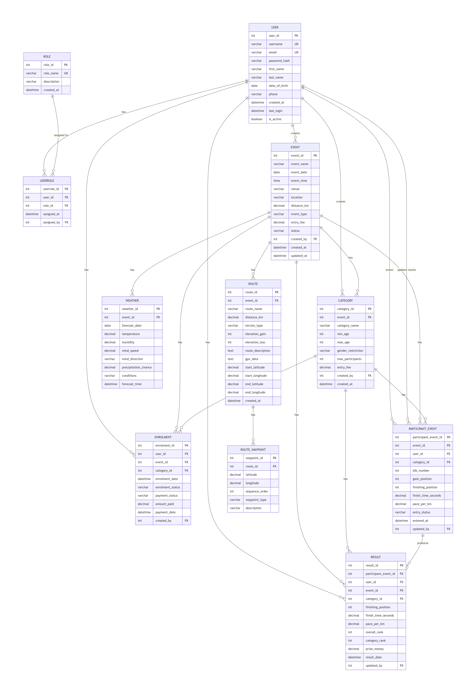

# RaceDay System - Complete Database Schema

[](https://classroom.github.com/a/mr-hqvA6)

---

## Overview

The **RaceDay System** is a comprehensive event management database designed for **running, walking, and cycling events** in South Africa. This database schema supports the complete management of events, including:

- User management with role-based access (Organisers and Participants)
- Event creation and management
- Participant enrolment in event categories
- Weather forecasting for race day
- Route and course management
- Race results and performance tracking
- Payment and enrolment status management
- Role-based access control

---

## Technology Stack

| Component | Technology |
|-----------|------------|
| Database | Microsoft SQL Server |
| Management Tool | SQL Server Management Studio (SSMS) |
| Language | T-SQL |

---

## Database Schema

### Core Entities (11 Tables)

| # | Entity | Description |
|---|--------|-------------|
| 1 | USER | System users (Organisers and Participants) |
| 2 | ROLE | User roles (Organiser, Participant) |
| 3 | USERROLE | Junction table for User-Role many-to-many |
| 4 | EVENT | Main running/walking/cycling events |
| 5 | CATEGORY | Event categories (age groups, gender, etc.) |
| 6 | ENROLMENT | Participant enrolments in event categories |
| 7 | PARTICIPANT_EVENT | Participant entries in events |
| 8 | WEATHER | Weather forecasts for events |
| 9 | ROUTE | Event routes and courses |
| 10 | ROUTE_WAYPOINT | GPS waypoints along the route |
| 11 | RESULT | Participant race results |

---

## Entity Relationship Diagram (ERD)




## Installation Guide

### IMPORTANT: Follow These Steps in Order

To avoid errors, **you must create the database first** and then **create tables one by one in the correct order**.

---

### Prerequisites

- SQL Server Management Studio (SSMS) - Download Here
- SQL Server 2019 or later - Download Here
- Appropriate database permissions (CREATE TABLE, INSERT, ALTER)

---

### Step 1: Create the Database

Open SSMS and run this command first:

```sql
-- Create the database
CREATE DATABASE RaceDayDB;
GO

-- Switch to the new database
USE RaceDayDB;
GO

-- Verify you're in the correct database
SELECT DB_NAME() AS CurrentDatabase;
GO
```

**Expected Output:** `RaceDayDB`

---

### Step 2: Create Tables in Correct Order

> **IMPORTANT:** Tables must be created in the correct order to avoid foreign key errors.

#### Recommended Table Creation Order:

1. **USER** (Parent table)
2. **ROLE** (Parent table)
3. **USERROLE** (References USER and ROLE)
4. **EVENT** (Parent table)
5. **CATEGORY** (References EVENT)
6. **ENROLMENT** (References USER, EVENT, CATEGORY)
7. **PARTICIPANT_EVENT** (References EVENT, USER, CATEGORY)
8. **WEATHER** (References EVENT)
9. **ROUTE** (References EVENT)
10. **ROUTE_WAYPOINT** (References ROUTE)
11. **RESULT** (References PARTICIPANT_EVENT, USER, EVENT, CATEGORY)

---

### Step 3: Insert Sample Data


### Step 4: Verify Your Installation

Run these verification queries to confirm everything is working:


-- Get all users with their roles
SELECT 
    u.user_id,
    u.username,
    u.first_name,
    u.last_name,
    r.role_name
FROM [USER] u
INNER JOIN USERROLE ur ON u.user_id = ur.user_id
INNER JOIN ROLE r ON ur.role_id = r.role_id
ORDER BY u.user_id;
GO

-- Get all events with organiser names
SELECT 
    e.event_id,
    e.event_name,
    e.event_date,
    e.venue,
    e.location,
    e.event_type,
    e.status,
    u.first_name + ' ' + u.last_name AS organiser
FROM EVENT e
INNER JOIN [USER] u ON e.created_by = u.user_id;
GO

-- Get event with weather forecast
SELECT 
    e.event_name,
    e.event_date,
    w.temperature,
    w.humidity,
    w.wind_speed,
    w.conditions,
    w.precipitation_chance
FROM EVENT e
LEFT JOIN WEATHER w ON e.event_id = w.event_id
WHERE e.event_id = 1;
GO
```

---

## Common Errors and Solutions

| Error | Cause | Solution |
|-------|-------|----------|
| Database 'RaceDayDB' does not exist | Database not created | Run Step 1 first |
| Invalid object name 'USER' | Table not created in correct order | Create parent tables first |
| Foreign key constraint | Referenced table doesn't exist | Check table creation order |
| Permission denied | Insufficient privileges | Run as db_owner or sysadmin |
| Column name not found | Wrong column name or table | Check spelling and use correct table |

---

## How to Drop All Tables (Reset Database)

```sql
-- WARNING: This deletes ALL data!
-- Drop in reverse order (child tables first)

DROP TABLE IF EXISTS RESULT;
DROP TABLE IF EXISTS ROUTE_WAYPOINT;
DROP TABLE IF EXISTS ROUTE;
DROP TABLE IF EXISTS WEATHER;
DROP TABLE IF EXISTS PARTICIPANT_EVENT;
DROP TABLE IF EXISTS ENROLMENT;
DROP TABLE IF EXISTS CATEGORY;
DROP TABLE IF EXISTS EVENT;
DROP TABLE IF EXISTS USERROLE;
DROP TABLE IF EXISTS [USER];
DROP TABLE IF EXISTS ROLE;
GO

-- Drop the database
DROP DATABASE RaceDayDB;
GO
```

---

## Verification Queries

### View All Users with Roles
```sql
SELECT 
    u.user_id,
    u.username,
    u.first_name,
    u.last_name,
    r.role_name
FROM [USER] u
INNER JOIN USERROLE ur ON u.user_id = ur.user_id
INNER JOIN ROLE r ON ur.role_id = r.role_id
ORDER BY u.user_id;
GO
```

### View All Events with Organisers
```sql
SELECT 
    e.event_id,
    e.event_name,
    e.event_date,
    e.venue,
    e.status,
    u.first_name + ' ' + u.last_name AS organiser
FROM EVENT e
INNER JOIN [USER] u ON e.created_by = u.user_id;
GO
```


---

**Statement of Academic Integrity:** I confirm that all design decisions reflect my understanding of the RaceDay system. I have reviewed and validated all AI-generated content. The final submission represents my own work and analysis.

**Tools Used:** 
SSMS 
Mermaid live editor
MS Word
Text Editor


---

## References

- Microsoft SQL Server Documentation
- SQL Server Management Studio (SSMS) Guide
- SQL Foreign Key Constraints

---

## License

This project is for educational purposes only. All rights reserved.

---

© 2026 RaceDay System - All Rights Reserved
